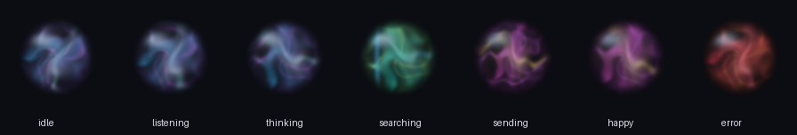

# Saylo

Saylo 是一个运行在 Windows 上的个人微信自动回复实验项目。它通过微信 UI Automation
读取当前白名单会话，使用 DeepSeek 生成回复，并提供实时渲染的透明桌面悬浮挂件。



## 主要功能

- 仅对白名单会话自动回复，默认启用演习模式，不会直接发送。
- 普通聊天、建议、情绪支持、作品分享、纠正澄清等对话模式。
- 自然语言创建和取消提醒，到点后主动发送一次。
- 可选联网检索；默认总结结果，不主动附原文或来源链接。
- 本地对话流水、长期记忆与主动问候。
- v3.2 实时程序化悬浮球：待机漂移、思考旋转、搜索扫描、发送收拢和情绪渐变。
- 后台监护、心跳检测、暂停、回复风格、联网与思考开关。
- 私密记录（对话、记忆、提醒、思考轨迹、日志）使用 AES-256-GCM 认证加密落盘。

## 安全与隐私

这个公开版本不包含任何密钥、微信 ID、联系人白名单、对话记录、记忆索引、提醒记录、
日志、PID 或运行状态。`config.py` 中的身份与白名单均为空，需要使用者自己配置。

运行期产生的私密记录保存在 `assistant/store/secure` 下，使用随机主密钥逐条 AES-256-GCM
加密；主密钥由用户口令（Argon2id 派生）和 Windows DPAPI 两份包装，都不以明文落盘。
首次使用需要在本地终端初始化口令，详见下文「私密记录」。

程序会把需要生成回复的近期上下文发送给所配置的模型服务。启用主动问候历史前，必须自行
评估隐私风险并将 `PROACTIVE_HISTORY_EXTERNAL_CONSENT` 改为 `True`。

微信冷启动后若只暴露 Qt 空壳，`wx_accessibility.py` 会针对明确验证过的微信版本，临时修改
运行中 `Weixin.dll` 的一个无障碍状态字节并验证 UIA 控件出现。它不修改磁盘文件，微信重启
后会还原，但写入第三方进程内存可能带来稳定性或平台风控风险。不了解风险时不要启用或运行。

更完整的发布前检查见 [SECURITY.md](SECURITY.md)。

## 环境

- Windows 10/11
- Python 3.11（推荐）
- 已登录的 Windows 微信客户端
- DeepSeek API key

微信 UI 结构会随版本改变。当前无障碍恢复代码只允许已明确列入
`assistant/wx_accessibility.py` 的版本，不会猜测未知版本的内存地址。

## 安装

```powershell
git clone https://github.com/YOUR_NAME/YOUR_REPOSITORY.git
cd YOUR_REPOSITORY
py -3.11 -m venv .venv
.\.venv\Scripts\Activate.ps1
python -m pip install --upgrade pip
pip install -r requirements.txt
```

初始化自己的 API key：

```powershell
python assistant\vault.py init
```

密钥会被加密到本机 `assistant/secrets.enc`，解密钥匙保存在项目外的用户目录。两者都已被
`.gitignore` 排除；请不要手动强制添加。

## 配置

编辑 `assistant/config.py`，至少检查：

```python
SELF_WXID = ""        # 填入自己的微信 ID
SELF_NICK = ""        # 填入当前登录账号昵称
USER_NAME = "User"    # 改成希望 Saylo 使用的称呼

DRY_RUN = True
REPLY_WHITELIST = []   # 确认无误后再填入唯一允许回复的会话
STRICT_SELF_ONLY = True
```

首次运行务必保持 `DRY_RUN = True`。确认读取、发送方识别和白名单都正确后，再自行决定是否
启用真实发送。这个项目设计用于本人账号之间测试，不应用于未经同意的第三方会话。

## 验证与启动

```powershell
python -m unittest assistant.test_dialogue_style assistant.test_runtime_supervision assistant.test_secure_records
python assistant\selfcheck.py
python assistant\probe_wx.py
```

通过后双击 `assistant/Start Saylo.vbs`，或在命令行运行：

```powershell
.\.venv\Scripts\pythonw.exe assistant\saylo_supervisor.pyw --widget desktop_widget_v3.pyw
```

双击 `assistant/Stop Saylo.vbs` 可安全停止。悬浮球右键菜单也提供暂停、联网、思考、风格和
退出控制。

## 私密记录（本地加密）

Saylo 的对话流水、长期记忆、提醒、模型思考轨迹和运行日志统一写入
`assistant/store/secure`，逐条使用 AES-256-GCM 认证加密；记录类型绑定进认证附加数据，
密文被修改、调换类型或使用错误密钥都会拒绝解密。查看时只在当前终端实时解密，不生成明文
临时文件。

首次初始化（在本地终端设置口令，输入不回显）：

```powershell
python assistant\records.py setup
```

常用命令：

```powershell
python assistant\records.py view                          # 实时解密查看
python assistant\records.py view --stream reasoning --tail 30
python assistant\records.py verify                        # 校验全部密文
```

口令不会被保存。要保留跨 Windows 用户或迁移机器后的恢复能力，需要一起备份密文与
`assistant/store/records.key.json` 并离线记住口令；当前 Windows 用户下由 DPAPI 保护的
`assistant/store/records.key.dpapi` 只用于本机无人值守运行，不是跨机器恢复所必需。

## 目录结构

```text
assistant/
  brain.py                 回复、分类、联网与质量检查
  persona.py               唯一生效的人格边界
  wx_agent.py              微信轮询、提醒和发送流程
  wx_bridge.py             UI Automation 读写
  wx_accessibility.py      微信无障碍树恢复（高风险、版本限定）
  reminders.py             提醒创建、取消与持久化
  emotion_state.py         跨轮情绪状态
  secure_records.py        私密记录认证加密存储
  records.py               记录初始化与解密查看工具
  desktop_widget_v3.pyw    v3.2 实时渲染挂件
  runtime_state.py         后台与挂件状态通道
  store/                   本地私密运行数据（Git 忽略）
tools/vm/                  可选 Hyper-V 模板，运行前必须检查磁盘和网络参数
```

## 发布说明

仓库未附带开源许可证。在你决定采用 MIT、Apache-2.0 或其他许可证前，默认仍是保留所有权利。
